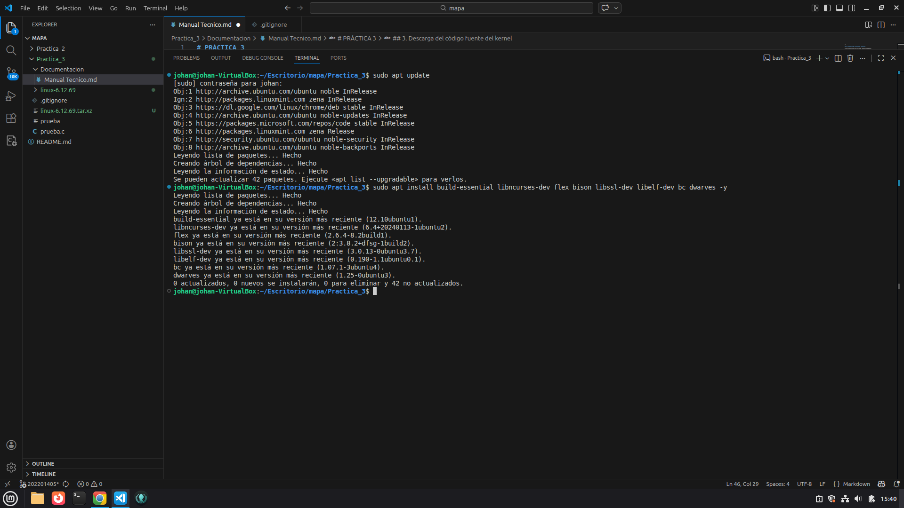
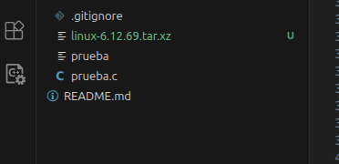
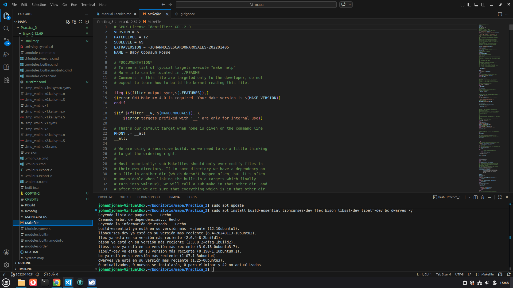
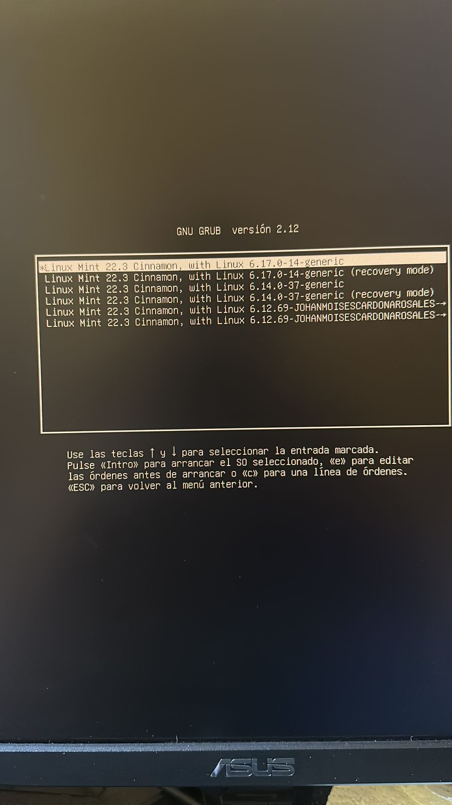
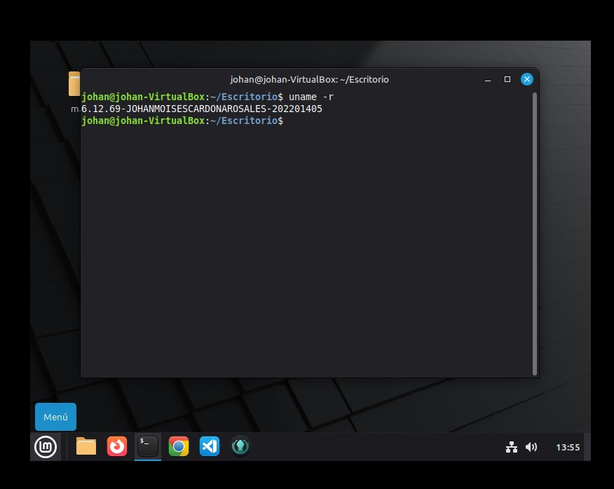

# PRÁCTICA 3
## Compilación y Configuración del Kernel Linux

**Curso:** Sistemas Operativos 2  
**Estudiante:** Johan Moises Cardona Rosales  
**Carnet:** 202201405  
**Versión del Kernel:** 6.12.69

---

## 1. Introducción

La presente práctica tuvo como objetivo preparar un entorno funcional en Linux para la compilación del kernel, comprendiendo la relación entre el compilador, las librerías de desarrollo y el sistema operativo. Se realizó la descarga, configuración, modificación y compilación del kernel Linux versión 6.12.69, incluyendo la personalización del `EXTRAVERSION` para identificar el kernel compilado con el nombre del estudiante y su número de carné.

---

## 2. Instalación de herramientas necesarias

Se verificó e instaló el entorno de compilación mediante:

```bash
sudo apt update
sudo apt install build-essential libncurses-dev flex bison libssl-dev libelf-dev bc dwarves -y
```




Se confirmó la instalación de:

- GCC
- make
- GDB
- Librerías de desarrollo en C

---

## 3. Descarga del código fuente del kernel

Se descargó el kernel proporcionado por el docente:

```
linux-6.12.69.tar.xz
```

Se descomprimió con:

```bash
tar -xf linux-6.12.69.tar.xz
cd linux-6.12.69
```


---

## 4. Configuración inicial

Se generó una configuración base compatible con el kernel vanilla:

```bash
make defconfig
```

---

## 5. Deshabilitación de verificación de firmas

Se ejecutó:

```bash
make menuconfig
```

Ruta seguida:

```
Enable loadable module support  --->
```

Se deshabilitó:

```
Module signature verification
Require modules to be validly signed
```


Se guardó la configuración.

---

## 6. Modificación del EXTRAVERSION

Se editó el archivo `Makefile`:

```bash
nano Makefile
```

Se modificó la línea:

```makefile
EXTRAVERSION =
```

Por:

```makefile
EXTRAVERSION = -JOHANMOISESCARDONAROSALES-202201405
```

Esto permitió personalizar el kernel compilado.




---

## 7. Compilación del kernel

Se compiló con:

```bash
make -j4
```


Resultado exitoso:

```
Kernel: arch/x86/boot/bzImage is ready  (#1)
```

---

## 8. Instalación del kernel

Se ejecutaron los siguientes comandos:

```bash
sudo make modules_install
sudo make install
sudo update-grub
```

---

## 9. Reinicio y verificación

Se reinició el sistema:

```bash
sudo reboot
```



Luego se verificó con:

```bash
uname -r
```

Resultado:

```
6.12.69-JOHANMOISESCARDONAROSALES-202201405
```



Esto confirma que el sistema está ejecutando el kernel compilado.

---

## 10. Conclusiones

- Se logró preparar correctamente el entorno de compilación.
- Se comprendió el proceso de configuración del kernel.
- Se personalizó el kernel mediante la variable `EXTRAVERSION`.
- Se resolvieron errores relacionados con certificados de Ubuntu al utilizar una configuración limpia.
- Se instaló y ejecutó exitosamente el kernel compilado.