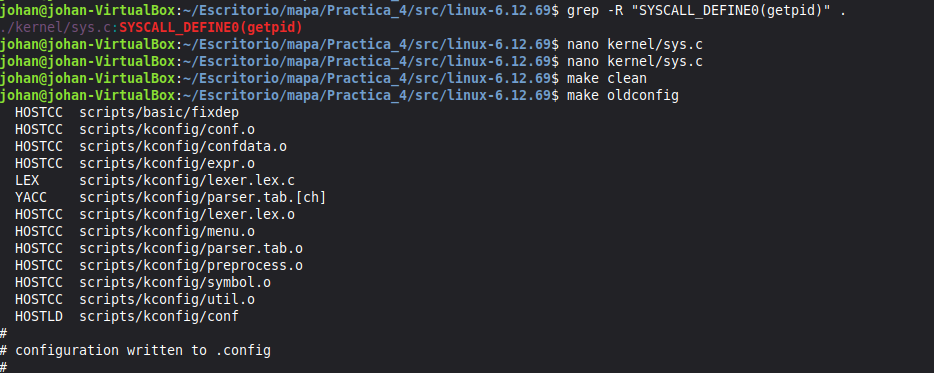
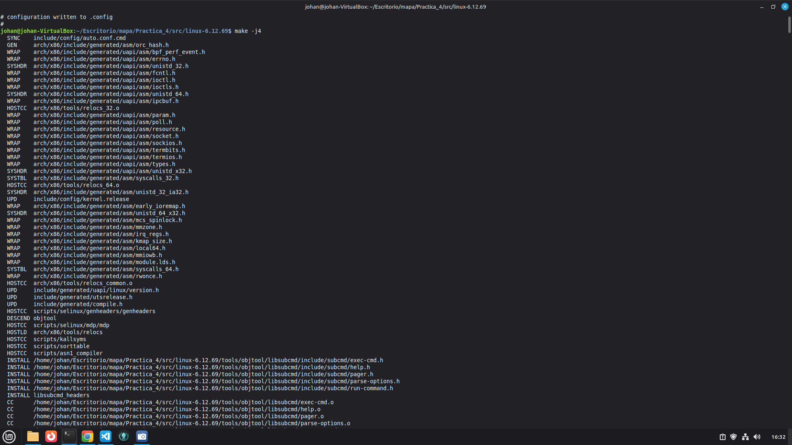
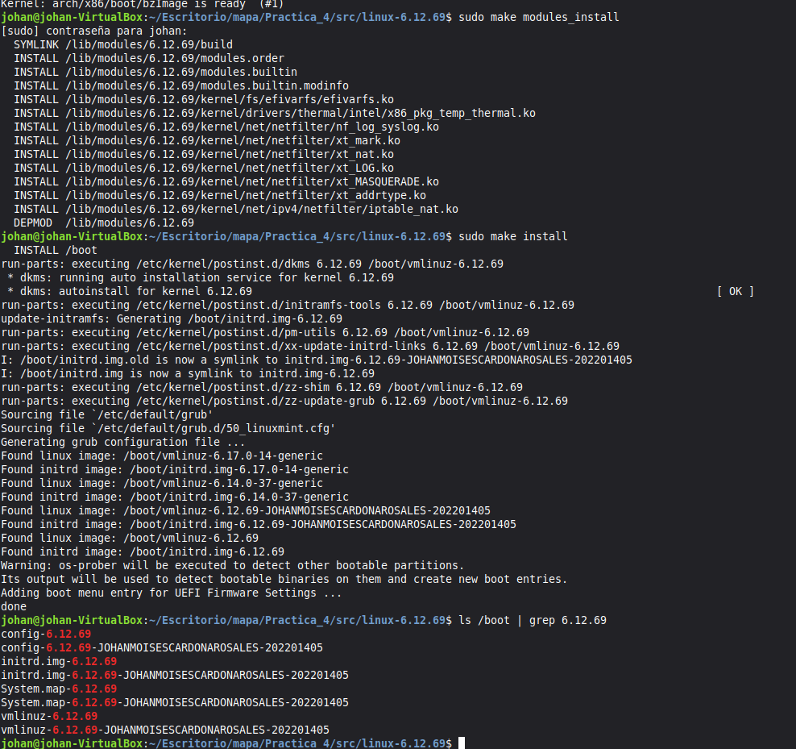
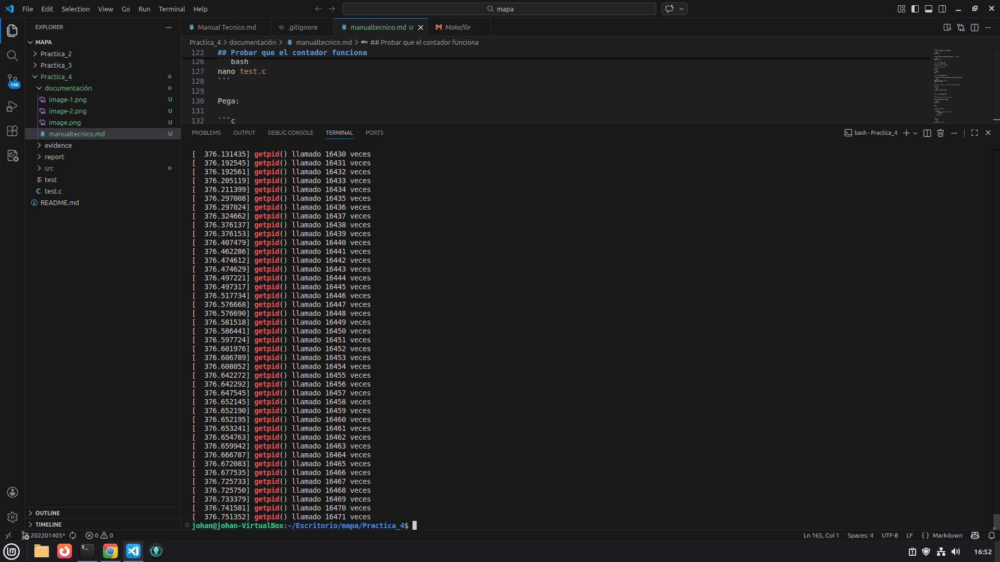

#### JOHAN MOISES CARDONA ROSALES  - 202201405
----
# Manual Técnico – Práctica 4: Modificación del Kernel de Linux

## Introducción

Este manual documenta el proceso de modificación y compilación del kernel de Linux para la Práctica 4 de Sistemas Operativos 2. La práctica consiste en intervenir directamente en el código fuente del núcleo, específicamente en la llamada al sistema `sys_getpid()`, para comprender su funcionamiento interno.

Se agregó un contador global a `sys_getpid()` que registra cuántas veces es invocada desde el espacio de usuario, junto con un mensaje vía `printk()` para visualizar el contador en `dmesg`. Luego se compiló e instaló una versión personalizada del kernel en una máquina virtual. El ejercicio refuerza conocimientos sobre llamadas al sistema, gestión de procesos y compilación del kernel en GNU/Linux.

---

## Objetivos

### General

Modificar y compilar el kernel de Linux para analizar el funcionamiento interno de `sys_getpid()`, verificando el impacto de los cambios en el comportamiento del sistema operativo.

### Específicos

- Localizar la implementación de `sys_getpid()` en el código fuente del kernel.
- Incorporar un contador global que registre el número de invocaciones a la función.
- Implementar un mensaje de registro con `printk()` visible en `dmesg`.
- Compilar e instalar el kernel modificado en una máquina virtual GNU/Linux.
- Verificar el funcionamiento mediante pruebas desde el espacio de usuario.
- Analizar el impacto de la modificación en el flujo de ejecución del kernel.

-----
## Procedimiento

## Descargar el kernel 6.12.69 (misma versión base)

Primero instalamos herramienta:

```bash
sudo apt install wget
```

Luego descargamos desde kernel.org:

```bash
wget https://cdn.kernel.org/pub/linux/kernel/v6.x/linux-6.12.69.tar.xz
```

Luego:

```bash
tar -xf linux-6.12.69.tar.xz
cd linux-6.12.69
```


## Copiar configuración de tu kernel actual

Esto es **CRÍTICO** para que compile igual al que se tenía

```bash
cp /boot/config-6.12.69-JOHANMOISESCARDONAROSALES-202201405 .config
```

Luego:

```bash
make oldconfig
```

Presiona **ENTER** a todo.


## Agregar variable global

Dentro del mismo archivo `kernel/sys.c`, pero arriba de la función, se agregó esto.

```c
static int getpid_counter = 0;
```

Ya con el cambio implementado quedó así:

```c

static int getpid_counter = 0;

SYSCALL_DEFINE0(getpid)
{
        return task_tgid_vnr(current);
}
```

## Modificar la función

Ahora modifica la función para que quede así:

```c
SYSCALL_DEFINE0(getpid)
{
        getpid_counter++;

        printk(KERN_INFO "getpid() llamado %d veces\n", getpid_counter);

        return task_tgid_vnr(current);
}
```

Primero limpiamos por seguridad:

```bash
make clean
```

Luego prepara configuración basada en  `.config`:

```bash
make oldconfig
```



Presiona **ENTER** a todo.

## Compilar el kernel

Ejecutar

```bash
make -j4
```



Si ejecutó sin ningun problema, entonces ejecutaremos:

```bash
sudo make modules_install
sudo make install
```

## Verificar que el nuevo kernel quedó registrado

Ejecuta:

```bash
ls /boot | grep 6.12.69
```





## Probar que el contador funciona

Creamos un programa de prueba:

```bash
nano test.c
```


```c
#include <unistd.h>

int main() {
    for(int i = 0; i < 5; i++) {
        getpid();
    }
    return 0;
}
```

Compila:

```bash
gcc test.c -o test
./test
```

Luego revisamos el log:


```bash
dmesg | tail
```


Resultado:

```bash
getpid() llamado 1 veces
getpid() llamado 2 veces
getpid() llamado 3 veces
```




----

## Conclusiones

- Intervenir directamente en `sys_getpid()` demostró que el kernel puede ser instrumentado y extendido sin alterar el comportamiento visible para el usuario.

- El uso de `printk()` con `dmesg` es una herramienta sencilla y efectiva para depurar modificaciones dentro del espacio del kernel.

- El ciclo completo de compilación e instalación del kernel reforzó la comprensión del desarrollo a nivel de sistema operativo, desde el código fuente hasta la ejecución en un entorno real.

- Trabajar en entornos virtualizados es esencial al modificar el kernel, ya que permite experimentar sin riesgo de dejar el sistema inoperable.