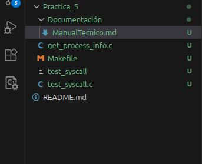
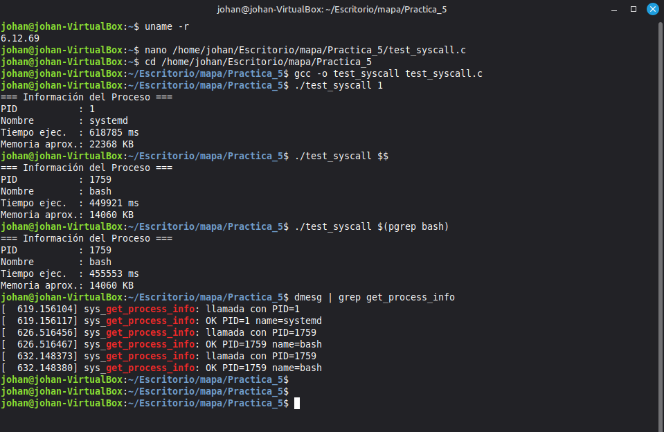

# Manual Técnico – Práctica 5

**Universidad San Carlos de Guatemala**  
Facultad de Ingeniería – Ingeniería en Ciencias y Sistemas  
Sistemas Operativos 2

**Estudiante:** Johan Moises Cardona Rosales  
**Carné:** 202201405  
**Fecha:** Guatemala, 04 de marzo 2026

---

## 1. Introducción

Este manual técnico documenta el proceso de diseño, implementación y verificación de una nueva llamada al sistema (syscall) en el kernel de Linux versión 6.12.69 LTS. La syscall creada, denominada `sys_get_process_info`, permite a cualquier proceso en espacio de usuario consultar información de otro proceso mediante su PID.

El trabajo forma parte de la Práctica 5 del curso Sistemas Operativos 2 y tiene como objetivo que el estudiante comprenda la interacción entre el espacio de usuario y el espacio de kernel, así como el ciclo completo de desarrollo sobre el núcleo de Linux.

---

## 2. Requisitos del Sistema

### 2.1 Hardware

| Componente      | Especificación mínima                                  |
|-----------------|--------------------------------------------------------|
| Procesador      | x86_64, 2 núcleos o más                                |
| Memoria RAM     | 4 GB (recomendado 8 GB para compilación)               |
| Almacenamiento  | 40 GB libres para código fuente y compilación          |
| Virtualización  | VirtualBox 6.x o superior                             |

### 2.2 Software

| Componente           | Versión / Detalle                                                              |
|----------------------|--------------------------------------------------------------------------------|
| Sistema Operativo    | Linux Mint (basado en Debian/Ubuntu)                                           |
| Kernel fuente        | Linux 6.12.69 LTS                                                              |
| Compilador           | GCC                                                                            |
| Herramientas de build| make, build-essential, libncurses-dev, bison, flex, libssl-dev, libelf-dev, bc |
| Control de versiones | Git                                                                            |
| Depuración           | dmesg, strace, gdb (opcional)                                                  |

---

## 3. Arquitectura de la Solución

La solución se compone de tres elementos principales que interactúan entre sí:

- **Modificaciones al kernel:** registro de la syscall en la tabla `syscall_64.tbl`, declaración del prototipo en `syscalls.h` y definición del `struct process_info` en un header propio.
- **Implementación de la syscall:** archivo `get_process_info.c` dentro de la carpeta `Practica_5/`, integrado al árbol de compilación del kernel mediante su Makefile.
- **Programa de usuario:** `test_syscall.c` que invoca la syscall número 463 usando la función `syscall()` de la biblioteca estándar de C.

### 3.1 Flujo de una llamada

Cuando el programa de usuario ejecuta `syscall(463, pid, &info)`, el procesador genera una interrupción de software que transfiere el control al kernel. El kernel identifica el número 463 en su tabla de syscalls y ejecuta `sys_get_process_info`. Esta función busca el proceso por su PID usando la estructura `task_struct`, copia los datos al buffer del usuario mediante `copy_to_user()` y retorna al espacio de usuario con el resultado.

```
[Programa de usuario]
        |
        |  syscall(463, pid, &info)
        v
[Interrupción de software]
        |
        v
[Kernel – syscall_64.tbl entrada 463]
        |
        v
[sys_get_process_info]
        |
        |-- find_vpid(pid) → task_struct
        |-- Llenar struct process_info
        |-- copy_to_user()
        |
        v
[Retorno al espacio de usuario]
```

---

## 4. Descripción de Métodos Implementados

### 4.1 `sys_get_process_info`

**Archivo:** `Practica_5/get_process_info.c`

**Prototipo:**
```c
SYSCALL_DEFINE2(get_process_info, pid_t, pid, struct process_info __user *, info)
```

**Descripción:** Recibe un PID y un puntero a una estructura `process_info` en espacio de usuario. Localiza el proceso en la tabla de procesos del kernel usando `find_vpid()` y `pid_task()`. Llena la estructura con el nombre del proceso, su PID, el tiempo de ejecución en milisegundos y el uso de memoria virtual en KB. Finalmente copia la estructura al espacio de usuario con `copy_to_user()`.


### 4.2 `struct process_info`

**Archivo:** `include/linux/process_info.h`

Esta estructura es el contrato de datos entre el kernel y el espacio de usuario.

| Campo          | Tipo               | Descripción                              |
|----------------|--------------------|------------------------------------------|
| `pid`          | `pid_t`            | Identificador del proceso                |
| `name[16]`     | `char[]`           | Nombre del proceso (`task->comm`)        |
| `exec_time_ms` | `unsigned long long` | Tiempo de ejecución en milisegundos    |
| `mem_kb`       | `unsigned long`    | Memoria virtual aproximada en KB         |

```c
#ifndef _LINUX_PROCESS_INFO_H
#define _LINUX_PROCESS_INFO_H

struct process_info {
    pid_t pid;
    char name[16];
    unsigned long long exec_time_ms;
    unsigned long mem_kb;
};

#endif /* _LINUX_PROCESS_INFO_H */
```

---

## 5. Archivos Modificados en el Kernel

| Archivo                                          | Modificación realizada                                              |
|--------------------------------------------------|---------------------------------------------------------------------|
| `arch/x86/entry/syscalls/syscall_64.tbl`         | Se agregó la entrada número 463 para `get_process_info`             |
| `include/linux/syscalls.h`                       | Se declaró el prototipo `asmlinkage` de la nueva syscall            |
| `include/linux/process_info.h`         | Header con la definición de `struct process_info`                   |
| `Practica_5/get_process_info.c`        | Implementación completa de la syscall                               |
| `Practica_5/Makefile`                  | Indica al sistema de build que compile `get_process_info.o`         |
| `Makefile`                    | Se agregó `Practica_5/` a la variable `core-y`                      |


### Detalle de cambios clave

**`syscall_64.tbl`** – línea agregada al final de la sección `common`:
```
463    common    get_process_info    sys_get_process_info
```

**`syscalls.h`** – prototipo agregado antes del `#endif`:
```c
#include <linux/process_info.h>
asmlinkage long sys_get_process_info(pid_t pid, struct process_info __user *info);
```

**`Makefile` raíz** – variable `core-y` modificada:
```makefile
core-y := Practica_5/
```

**`Practica_5/Makefile`**:
```makefile
obj-y := get_process_info.o
```




---

## 6. Proceso de Compilación e Instalación

### 6.1 Configuración

Se utilizó la configuración del kernel activo como base:

```bash
cd /home/johan/Escritorio/Practica_5/src/linux-6.12.69
cp /boot/config-$(uname -r) .config
make olddefconfig
```

### 6.2 Compilación

```bash
make -j$(nproc)
```

Confirmación de éxito:
```
Kernel: arch/x86/boot/bzImage is ready  (#2)
```

### 6.3 Instalación

```bash
sudo make modules_install
sudo make install
sudo update-grub
sudo reboot
```

### 6.4 Verificación del kernel

```bash
uname -r
# Output: 6.12.69
```

---

## 7. Programa de Usuario

**Archivo:** `test_syscall.c`


**Compilación:**
```bash
gcc -o test_syscall test_syscall.c
```




---

## 8. Observaciones Técnicas

- El `struct process_info` no puede definirse directamente en `syscalls.h` porque ese header se incluye en múltiples archivos del kernel antes de que el tipo sea conocido. La solución fue crear un header propio `process_info.h`.
- Se utiliza `rcu_read_lock()` / `rcu_read_unlock()` para proteger el acceso a la tabla de procesos, garantizando que el `task_struct` no sea liberado mientras se lee.
- El tiempo de ejecución se calcula como la diferencia entre `ktime_get_ns()` y `task->start_time`, ambos en nanosegundos, convertido a milisegundos dividiendo entre `1,000,000`.
- La memoria reportada es la memoria virtual total (`total_vm * PAGE_SIZE / 1024`), que es una aproximación. La memoria residente real requeriría recorrer las VMAs del proceso.
- Cada invocación queda registrada en el log del kernel mediante `printk()`, visible con `dmesg`.

---

## 9. Conclusiones

- Se implementó exitosamente una nueva syscall en el kernel de Linux 6.12.69, demostrando el ciclo completo: modificación del código fuente, compilación, instalación y pruebas.
- La separación entre espacio de usuario y espacio de kernel se vio reflejada en el uso obligatorio de `copy_to_user()` para transferir datos de forma segura.
- El sistema de build del kernel es flexible: basta con agregar un directorio al Makefile raíz y proporcionar un Makefile interno para que el nuevo código se integre automáticamente.
- El uso de `printk()` resultó fundamental para verificar el correcto funcionamiento de la syscall durante las pruebas.

---
