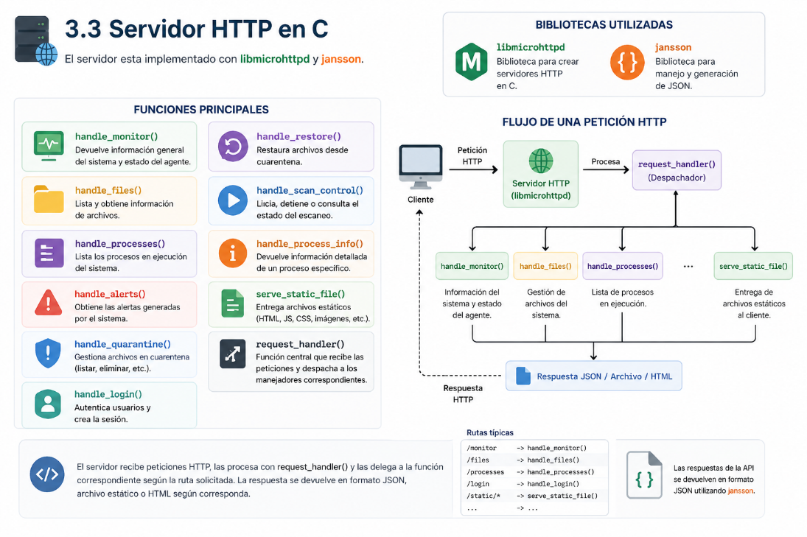
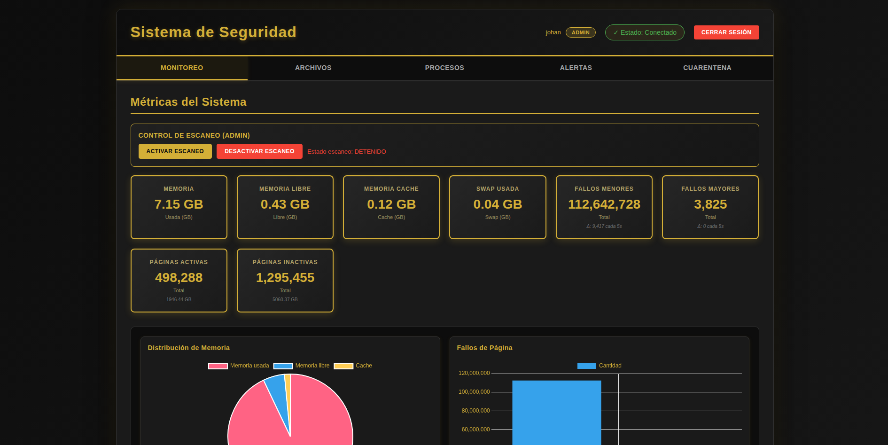
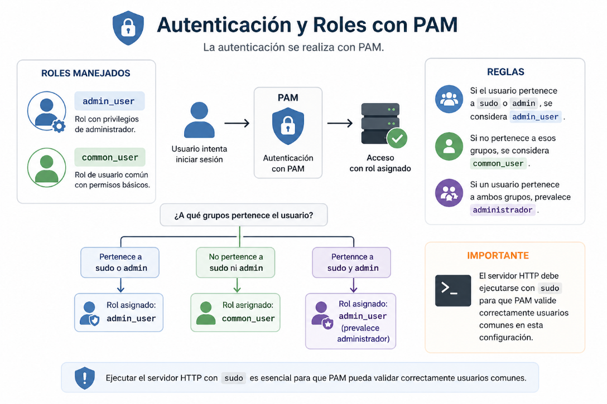

# Manual Tecnico - Proyecto Único
##### Johan Moises Cardona Rosales - 202201405

## 1. Descripcion general

Este proyecto implementa un sistema integral de monitoreo y seguridad sobre Linux. La arquitectura esta compuesta por:

- Syscalls personalizadas en kernel.
- Un daemon en C que consume esas syscalls.
- Un servidor HTTP en C que expone la informacion por API REST.
- Un frontend web para visualizacion y control.

El objetivo es recolectar metricas del sistema, analizar archivos y procesos, generar alertas de seguridad y presentar toda la informacion en tiempo real.

## 2. Estructura del proyecto

Dentro de `ProgramaIntermedio` se encuentran los componentes principales:

- `src/` codigo fuente del daemon y del servidor HTTP.
- `include/` headers compartidos.
- `frontend/` dashboard web.
- `config/` archivos de prueba y blacklist.
- `logs/` registros de ejecucion.
- `Documentacion/` manual tecnico y manual de usuario.

## 3. Componentes del sistema

### 3.1 Kernel

El kernel expone las llamadas al sistema necesarias para el proyecto:

- `sys_get_system_monitor()`
- `sys_file_analize()`
- `sys_scan_processes()`
- `sys_quarantine_file(path)`
- `sys_restore_file(path)`
- `sys_get_quarantine_list()`
- `sys_simulate_panic(msg)`
- `sys_get_process_info(pid)`

### 3.2 Daemon en C

El daemon es el nucleo del sistema en espacio de usuario. Su funcion es consultar periodicamente el kernel, procesar los datos y generar JSON.

#### Hilos principales

- Hilo de monitoreo:
  - consulta metricas del sistema
  - obtiene informacion de procesos
  - calcula deltas de fallos

- Hilo de escaneo:
  - recorre `config/monitor`
  - calcula hashes SHA-256
  - compara contra `hash_blacklist.json`
  - detecta archivos nuevos o modificados
  - genera alertas
  - pone archivos en cuarentena si la severidad es `HIGH`

### 3.3 Servidor HTTP en C

El servidor esta implementado con `libmicrohttpd` y `jansson`.

Funciones principales:

- `handle_monitor()`
- `handle_files()`
- `handle_processes()`
- `handle_alerts()`
- `handle_quarantine()`
- `handle_login()`
- `handle_restore()`
- `handle_scan_control()`
- `handle_process_info()`
- `serve_static_file()`
- `request_handler()`



### 3.4 Frontend

El dashboard esta hecho con HTML, CSS y JavaScript.

Incluye:

- monitoreo en tiempo real
- listado de archivos analizados
- visualizacion de amenazas detectadas
- panel de alertas
- cuarentena
- control de escaneo para administrador
- consulta de procesos por PID para administrador




## 4. Autenticacion y roles

La autenticacion se realiza con PAM.

Roles manejados:

- `admin_user`
- `common_user`

Reglas:

- Si el usuario pertenece a `sudo` o `admin`, se considera `admin_user`.
- Si no pertenece a esos grupos, se considera `common_user`.
- Si un usuario pertenece a ambos grupos, prevalece administrador.



## 5. Formato de datos generados

### 5.1 `/tmp/daemon_monitor.json`

Contiene metricas del sistema:

- memoria usada
- memoria libre
- cache
- swap
- fallos menores
- fallos mayores
- paginas activas
- paginas inactivas

### 5.2 `/tmp/daemon_files.json`

Contiene archivos analizados con:

- ruta
- tamano
- timestamp
- hash
- estado del archivo
- informacion de malware detectado

### 5.3 `/tmp/daemon_processes.json`

Contiene los procesos sospechosos detectados.

### 5.4 `/tmp/daemon_alerts.json`

Contiene alertas con:

- timestamp
- tipo
- severidad
- descripcion
- mensaje
- archivo

### 5.5 `/tmp/daemon_quarantine.json`

Contiene la lista de archivos en cuarentena con:

- ruta
- timestamp de cuarentena
- hash
- severidad

## 6. Flujo de ejecucion

1. El daemon consulta el kernel.
2. El daemon escribe los JSON en `/tmp`.
3. El servidor HTTP lee esos JSON.
4. El frontend consume la API REST.
5. El usuario visualiza la informacion en el dashboard.

## 7. Compilacion

Desde `ProgramaIntermedio`:

```bash
make clean
make
```

Esto compila:

- `daemon_monitor`
- `server_http`

## 8. Ejecucion

### 8.1 Iniciar el daemon

```bash
sudo ./daemon_monitor
```

### 8.2 Iniciar el servidor HTTP

```bash
sudo ./server_http
```

### 8.3 Acceso al dashboard

Abrir en el navegador:

```text
http://localhost:3000
```

## 9. Endpoints principales

- `GET /` - Dashboard web
- `POST /api/login` - Autenticacion PAM
- `GET /api/monitor` - Metricas del sistema
- `GET /api/files` - Archivos analizados
- `GET /api/processes` - Procesos sospechosos
- `GET /api/alerts` - Alertas de seguridad
- `GET /api/quarantine/list` - Archivos en cuarentena
- `POST /api/restore` - Restaurar archivo de cuarentena
- `POST /api/scan/start` - Activar escaneo
- `POST /api/scan/stop` - Desactivar escaneo
- `POST /api/process/info` - Informacion detallada por PID
- `GET /api/scan/status` - Estado del escaneo

## 10. Consideraciones tecnicas

- El dashboard solo visualiza informacion.
- La logica de deteccion y severidad se ejecuta en el daemon.
- El kernel no realiza clasificacion de severidad.
- La cuarentena y restauracion se realizan en espacio de usuario moviendo archivos hacia un almacenamiento local de cuarentena.
- El sistema usa SHA-256 para firmas.

## 11. Verificacion rapida

Para comprobar que todo esta activo:

```bash
ps aux | grep daemon_monitor
ps aux | grep server_http
curl http://localhost:3000/api/monitor
curl http://localhost:3000/api/alerts
```

