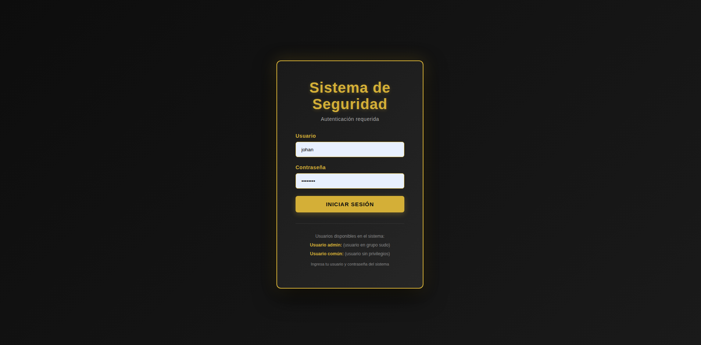
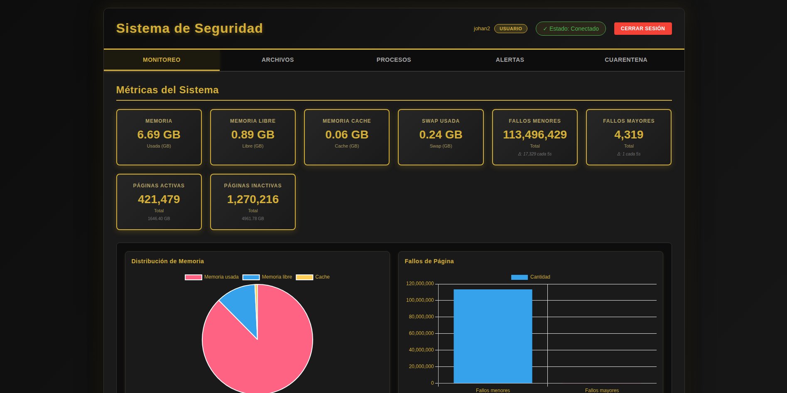
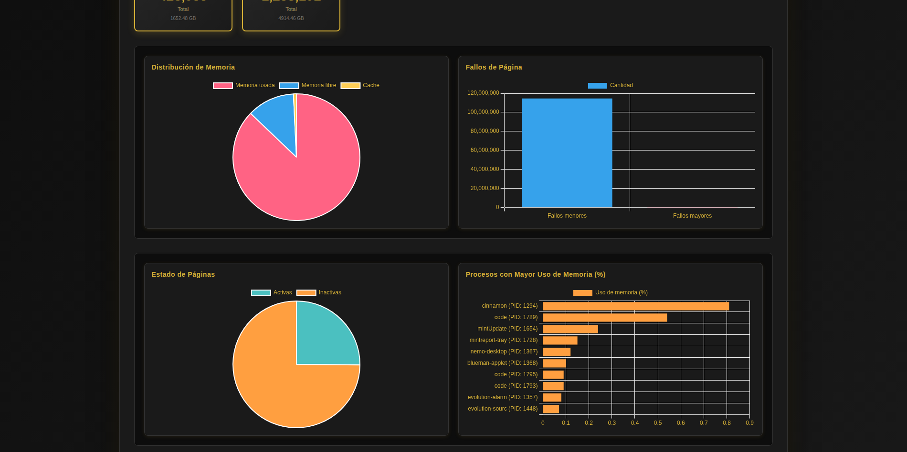
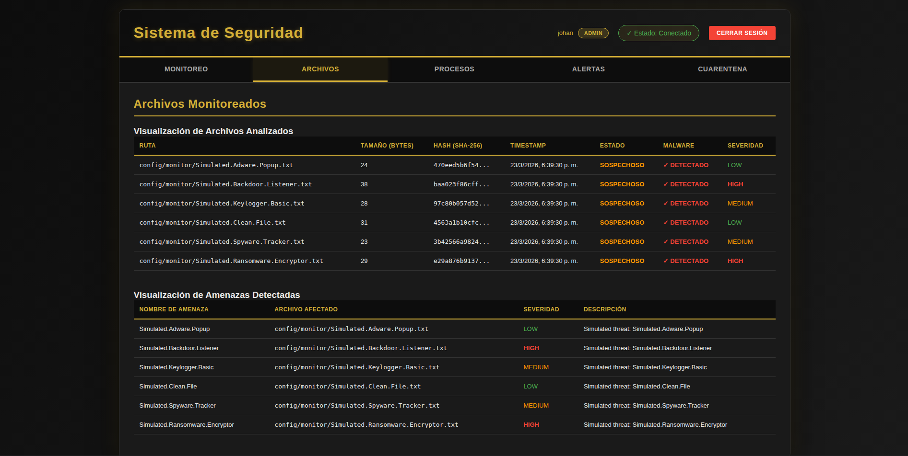
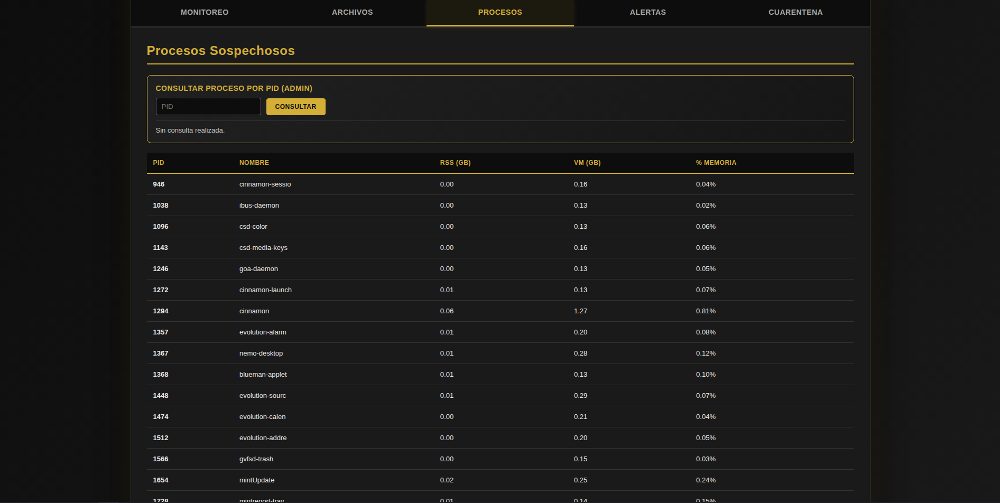
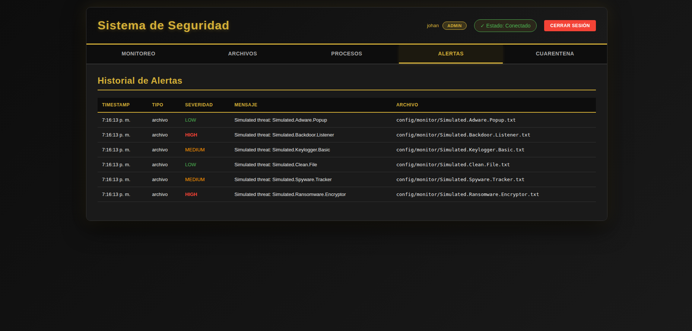
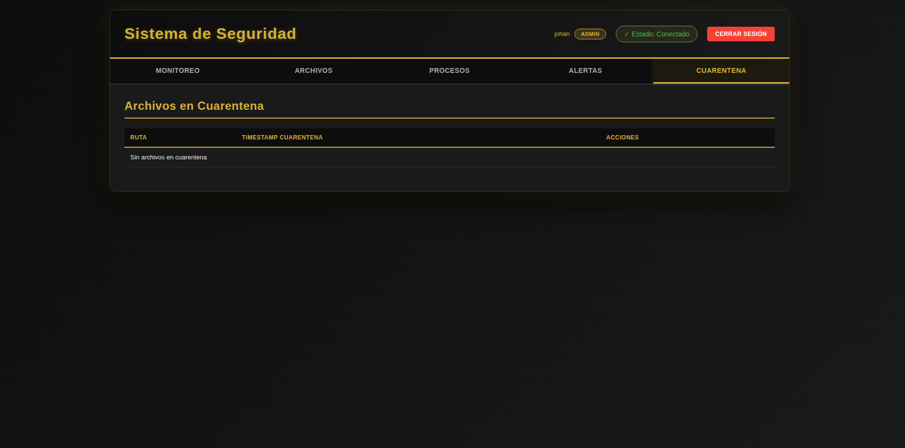
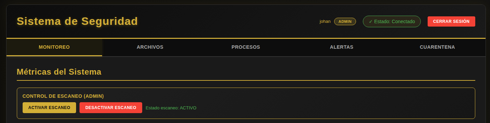

# Manual de Usuario

## 1. Objetivo

Este manual explica como usar el dashboard web del sistema de seguridad, incluyendo el inicio de sesion, la navegacion por pestañas y las acciones disponibles segun el rol del usuario.

## 2. Requisitos previos

Antes de abrir el dashboard:

- El daemon debe estar ejecutandose.
- El servidor HTTP debe estar ejecutandose.
- El servidor HTTP debe iniciarse con `sudo`.
- Debe existir una cuenta valida del sistema Linux.

## 3. Inicio del sistema

Desde la carpeta `ProgramaIntermedio` ejecuta:

```bash
sudo ./daemon_monitor
sudo ./server_http
```

Luego abre el navegador en:

```text
http://localhost:3000
```

## 4. Inicio de sesion

En la pantalla de login debes ingresar:

- nombre de usuario
- contraseña



Si el usuario pertenece a un grupo administrador, entrara como `admin_user`.
Si no pertenece a `sudo` ni `admin`, entrara como `common_user`.

## 5. Roles disponibles

### 5.1 Usuario administrador

Puede:

- ver todas las metricas
- ver alertas
- activar el escaneo
- desactivar el escaneo
- consultar informacion detallada de un proceso por PID
- restaurar archivos de cuarentena


### 5.2 Usuario comun

Puede:

- ver metricas
- ver alertas
- ver archivos analizados
- ver amenazas detectadas
- ver cuarentena

No puede:

- activar o desactivar escaneo
- consultar informacion detallada por PID
- restaurar archivos de cuarentena



## 6. Pestañas del dashboard

### 6.1 Monitoreo

Muestra:

- memoria usada
- memoria libre
- cache
- swap
- fallos menores
- fallos mayores
- paginas activas
- paginas inactivas
- grafica de evolucion

Tambien muestra el estado del escaneo para administradores.



### 6.2 Archivos

Muestra:

- lista de archivos analizados
- estado del archivo: limpio, modificado o sospechoso
- hash parcial
- timestamp de ultima modificacion
- informacion de malware detectado

Tambien incluye una seccion de amenazas detectadas con:

- nombre de la amenaza
- archivo afectado
- severidad
- descripcion



### 6.3 Procesos

Muestra los procesos sospechosos detectados.

Si eres administrador, puedes ingresar un PID para consultar informacion detallada del proceso.



### 6.4 Alertas

Muestra el historial de alertas de seguridad.

Cada alerta incluye:

- tipo de evento
- severidad
- descripcion
- fecha y hora
- archivo relacionado

Las alertas mas recientes aparecen primero.





### 6.5 Cuarentena

Muestra los archivos puestos en cuarentena.

Cada registro incluye:

- ruta
- fecha de cuarentena
- accion de restaurar, solo si eres administrador



## 7. Controles del administrador

Si tienes rol administrador, veras dos botones en el panel de monitoreo:

- Activar escaneo
- Desactivar escaneo

Tambien veras el panel para consultar procesos por PID.



## 8. Actualizacion de informacion

El dashboard se actualiza automaticamente cada 5 segundos.

Si no ves cambios inmediatos:

- espera unos segundos
- refresca la pagina con Ctrl+F5

## 9. Errores comunes

### 9.1 No puedo iniciar sesion

Verifica:

- usuario correcto
- contraseña correcta
- que el servidor HTTP este corriendo con `sudo`

### 9.2 No carga informacion

Verifica:

- que `daemon_monitor` este activo
- que `server_http` este activo
- que el navegador este entrando a `http://localhost:3000`

### 9.3 Veo datos vacios

Puede pasar si:

- el daemon acaba de iniciar
- todavia no hubo archivos analizados
- no se detectaron alertas aun

## 10. Flujo recomendado de uso

1. Ejecuta el daemon.
2. Ejecuta el servidor HTTP con `sudo`.
3. Abre el navegador en `http://localhost:3000`.
4. Inicia sesion con un usuario valido.
5. Revisa monitoreo, archivos, procesos, alertas y cuarentena.
6. Si eres admin, activa o desactiva el escaneo segun necesites.

## 11. Comprobacion final

Al funcionar correctamente deberias poder:

- ver metricas en tiempo real
- ver alertas sin campos vacios
- ver archivos analizados y amenazas detectadas
- acceder como admin o usuario comun segun tu cuenta

